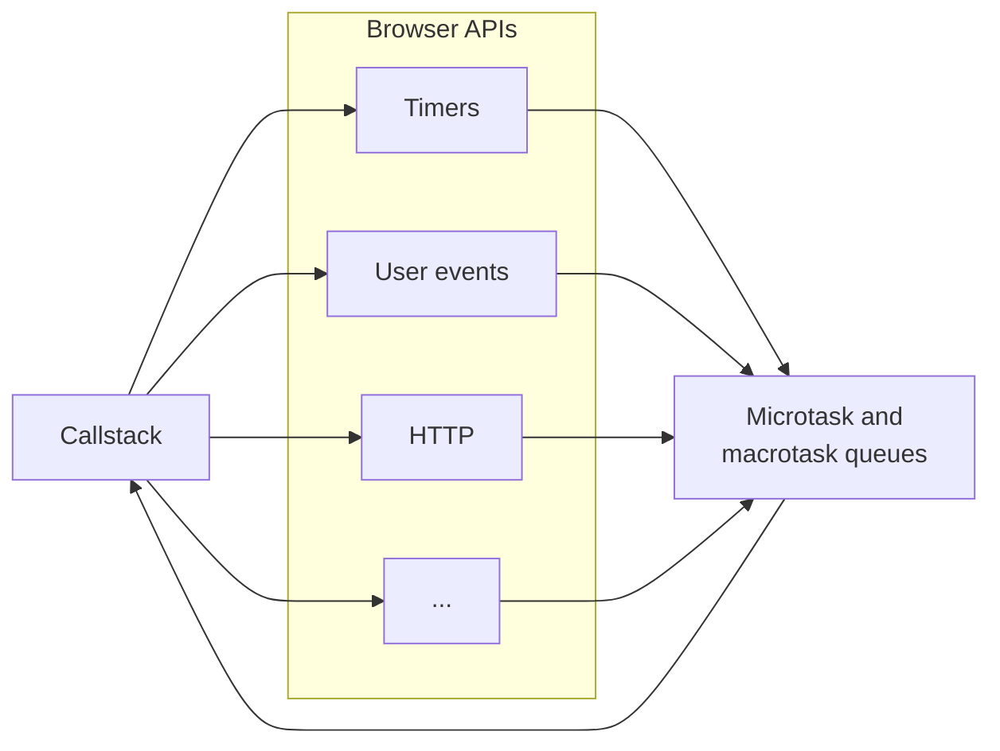
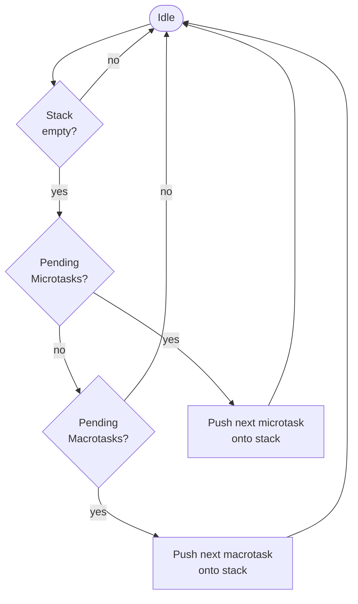

# The Event Loop

Javascript runs in a single-threaded and isolated process. It constantly sends requests to, and receives tasks from its runtime. The mechanism that determines in which order these tasks are executed is called the event loop.

## TL;DR

The event loop runs when the stack is empty. It executes all queued microtasks first. Once the microtask queue is empty, it executes the next macrotask.

## Callstack

The call stack is the list of JavaScript instructions to execute. As the JS engine reads the script, it pushes instructions onto the stack, and removes them when they complete.

Although the call stack is single-threaded, JavaScript can perform concurrent operations by delegating work (such as timers or network requests) to its runtime.

## Runtime

A runtime is an environment that sits between the operating system and the code. In this article, runtime refers to a JavaScript runtime. The most common examples are web browsers and NodeJS. Many other applications support JavaScript for scripting or extensions, but this article focuses on web browsers.

## Browser API

Browser APIs are JavaScript's interface to the runtime. They gives access to the DOM, timers, files I/O, and networking. Those APIs are invoked through JavaScript functions' call.

Examples include `setTimeout(func, 1000)`, `elem.addEventListener("click", handler)`, and `fetch(url)`. They all involve Browser APIs. Once the runtime completes an operation, it places the corresponding callback or promise into a task queue.

## Task queues

When the runtime finishes its task (e.g. a timer expires), it pushes a new task either on the **microtask queue** for higher priority, or on the **macrotask queue** for lower priority.

- **Microtasks** include promise reactions (async, await, then, catch, finally) and MutationObserver callbacks.

- **Macrotasks** include timers, user interactions, and other events.

## Event loop

The event loop runs when the call stack is empty. If there are pending microtasks, it executes them one by one by pushing them onto the stack. When no microtasks remains, it executes the next macrotask.

If executing a task schedules a new microtask, those microtask are processed before any subsequent macrotask.

In browsers, additional work may occur between task executions. Typically, the browser runs all microtasks, then performs rendering and UI updates, and only afterward executes a single macrotask.

## Notes

Some runtimes contain multiple micro and macrotask queues. While all microtasks have priority over macrotasks, tasks within each category may have different priority levels.

Additionally, although microtasks generally take precedence, runtimes may occasionally allow macrotasks to run to prevent starvation when microtasks are continuously queued.
